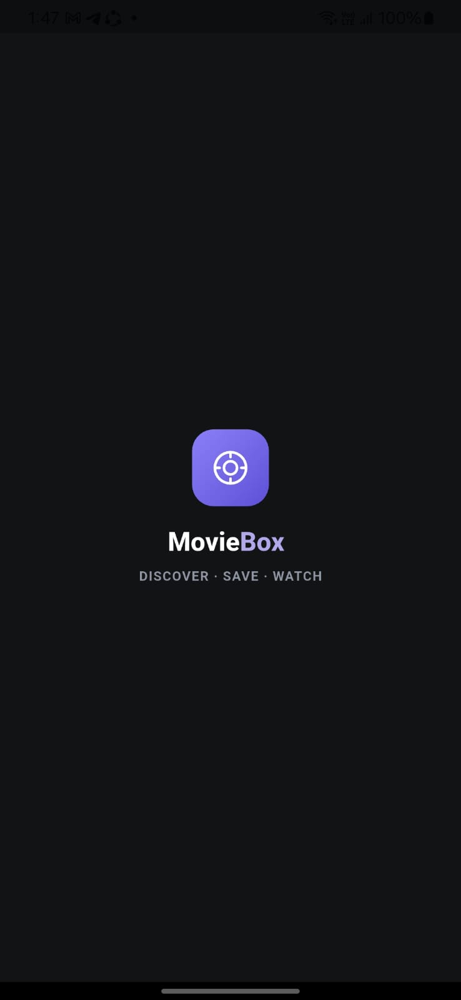
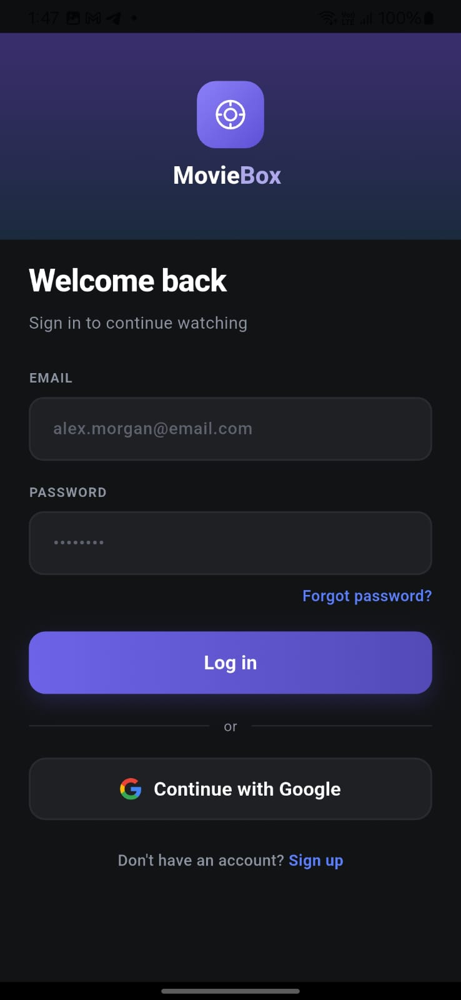
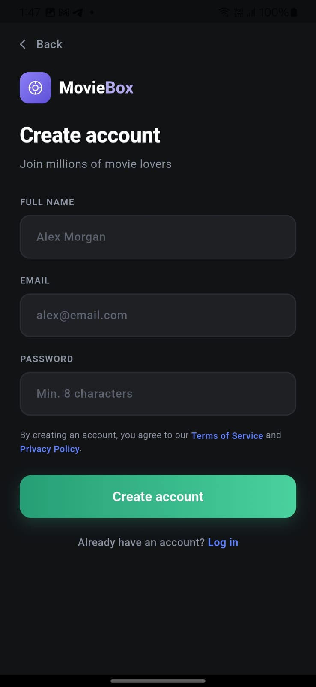
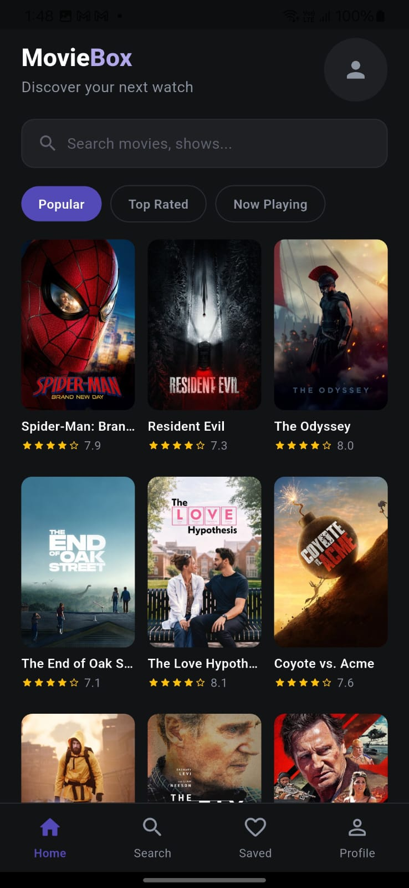
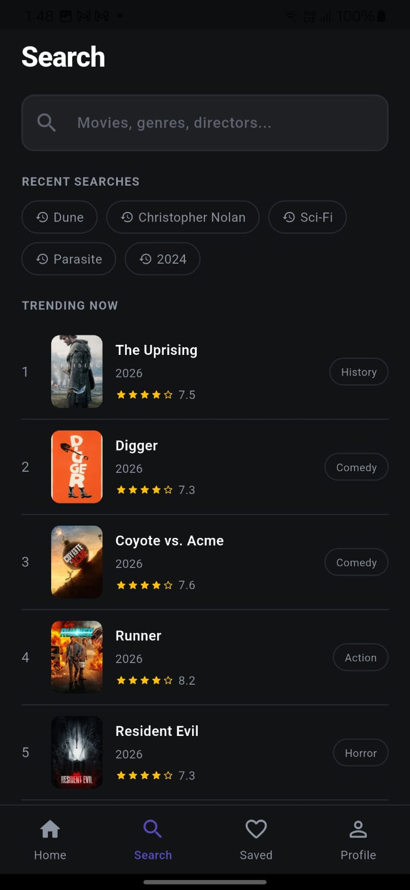
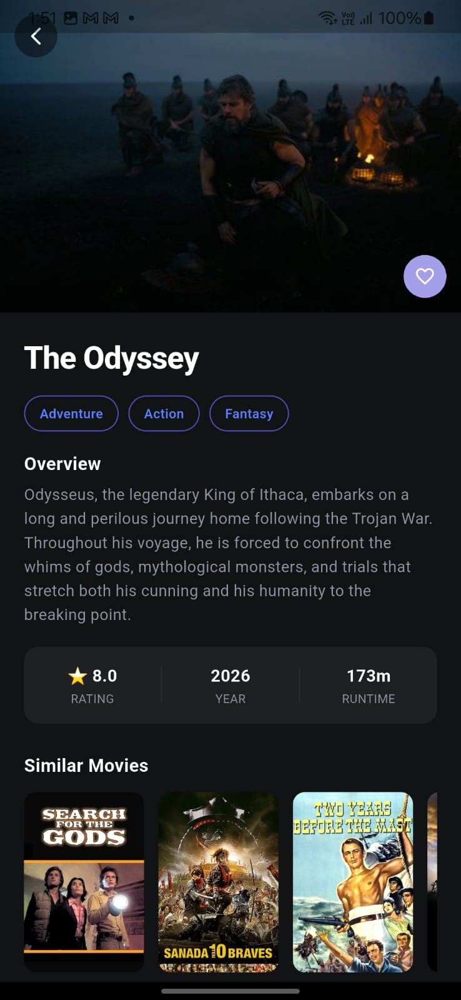
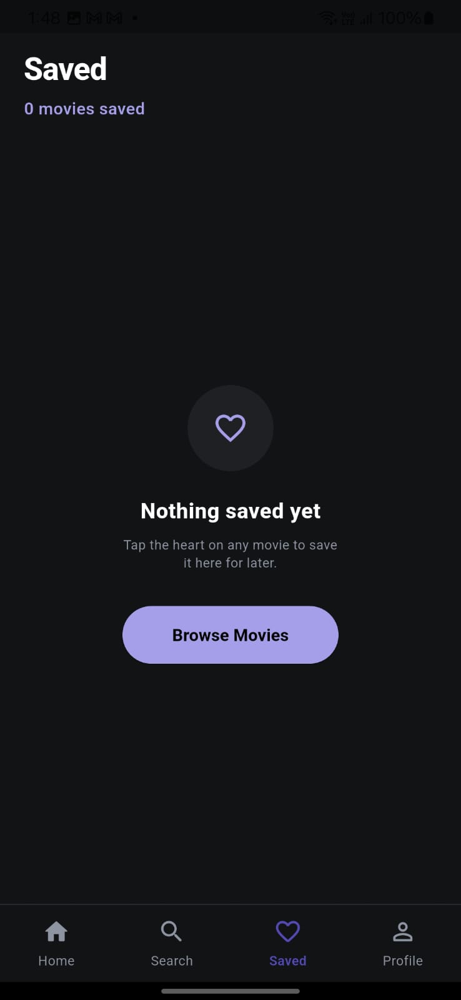
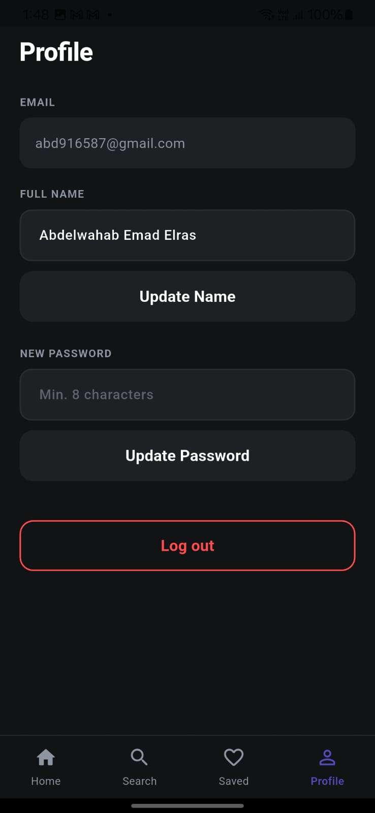

# 🎬 MovieBox

A Flutter movie discovery app that lets users browse, search, and save their favorite movies, with secure authentication and a clean, modern UI.

## ✨ Features

- 🔐 **Authentication** — Login & Register with Firebase Auth, plus **Sign in with Google**
- 🏠 **Home** — Browse trending, popular movies, top rated movies
- 🔍 **Search** — Find movies quickly by title
- 📄 **Details** — View full movie information (overview, rating, cast, etc.)
- ❤️ **Favorites** — Save and manage your favorite movies
- 👤 **Profile** — Manage user account and preferences
- 🚀 **Splash Screen** — Smooth app launch experience

## 🛠️ Tech Stack

- **Framework:** Flutter
- **Language:** Dart
- **Backend / Auth:** Firebase
- **Architecture:** Repository pattern with Service Locator (dependency injection)

## 📱 Screenshots

| Splash | Login | Register |
|--------|-------|----------|
|  |  |  |

| Home | Search | Details |
|------|--------|---------|
|  |  |  |

| Favorites | Profile |
|-----------|---------|
|  |  |

## 📂 Project Structure

The project follows a **feature-first** structure, where each screen has its own `Cubit` for state management, paired with its UI and widgets.

```
lib/
├── core/
│   ├── service_locator.dart      # Dependency injection (GetIt)
│   ├── constants/                # App-wide constants (colors, strings, assets)
│   ├── theme/                    # App theme & styling
│   └── utils/                    # Helper functions & extensions
│
├── data/
│   ├── models/                   # Data models (Movie, User, etc.)
│   └── repositories/
│       ├── profile_repo.dart          # Repository interface
│       ├── profile_repo_impl.dart     # Repository implementation
│       ├── movie_repo.dart
│       └── auth_repo.dart
│
├── screens/
│   ├── splash/
│   │   └── splash_screen.dart
│   │
│   ├── auth/
│   │   ├── login/
│   │   │   ├── login_screen.dart
│   │   │   ├── cubit/
│   │   │   │   ├── login_cubit.dart
│   │   │   │   └── login_state.dart
│   │   │   └── widgets/
│   │   │       └── google_sign_in_button.dart
│   │   └── register/
│   │       ├── register_screen.dart
│   │       ├── cubit/
│   │       │   ├── register_cubit.dart
│   │       │   └── register_state.dart
│   │       └── widgets/
│   │
│   ├── home/
│   │   ├── home_screen.dart
│   │   ├── cubit/
│   │   │   ├── home_cubit.dart
│   │   │   └── home_state.dart
│   │   └── widgets/
│   │       ├── movie_card.dart
│   │       ├── category_list.dart
│   │       └── trending_slider.dart
│   │
│   ├── search/
│   │   ├── search_screen.dart
│   │   ├── cubit/
│   │   │   ├── search_cubit.dart
│   │   │   └── search_state.dart
│   │   └── widgets/
│   │       └── search_result_item.dart
│   │
│   ├── details/
│   │   ├── details_screen.dart
│   │   ├── cubit/
│   │   │   ├── details_cubit.dart
│   │   │   └── details_state.dart
│   │   └── widgets/
│   │       ├── movie_info_section.dart
│   │       └── cast_list.dart
│   │
│   ├── favorites/
│   │   ├── favorites_screen.dart
│   │   ├── cubit/
│   │   │   ├── favorites_cubit.dart
│   │   │   └── favorites_state.dart
│   │   └── widgets/
│   │       └── favorite_item.dart
│   │
│   └── profile/
│       ├── profile_screen.dart
│       ├── cubit/
│       │   ├── profile_cubit.dart
│       │   └── profile_state.dart
│       └── widgets/
│           └── profile_option_tile.dart
│
├── widgets/                      # Shared/reusable widgets across screens
│   ├── custom_button.dart
│   ├── custom_text_field.dart
│   └── loading_indicator.dart
│
└── main.dart                     # App entry point, BlocProviders setup
